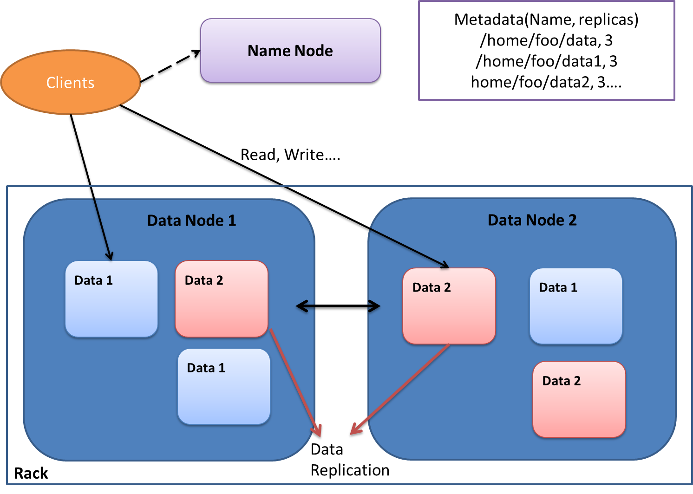

### Introduction

==============================================

Apache Hadoop is an open-sourced java framework for distributed storage and processing of very large dataset on computer clusters. It contains four modules: Hadoop Common, Hadoop Distributed File System (HDFS), Hadoop YARN and Hadoop MapReduce. In this report, We focus on the concepts and developments of the HDFS and MapReduce.  

### File System:HDFS

==============================================                   

A brilliant training of HDFS conducted by `NewCircle Training` can be found [here](https://www.youtube.com/watch?v=ziqx2hJY8Hg).

The Basic HDFS Architecture consists of a NameNode that manages the file system metadata and DataNodes that store the actual data as shown in the following illustration. The original data is sliced into several pieces and each piece is replicated into several copies and then distribute into different data node, which makes HDFS highly fault-tolerance. 

Hadoop provides a unix like shell that helps end-users to operate files without worrying about too many details. The list of command can be found [here](http://hadoop.apache.org/docs/current/hadoop-project-dist/hadoop-common/FileSystemShell.html). 

### Engine: From MapReduce To Spark

=============================================  

**MapReduce and Spark** 

Hadoop MapReduce is a software framework for easily writing applications which process vast amounts of data (multi-terabyte data-sets) in-parallel on large cluster. Generally speaking, map and reduce refer two tasks that Hadoop performs. Map takes a set of data and convert them into another set of data, while reduce takes the output from a map function and summarize them into a smaller set. Computations expressed in Hadoop MapReduce boil down to multiple iterations of (i) read data from HDFS, (ii) apply map and reduce, (iii) write back to HDFS. However, for many applications, this map-reduce cycle is not very efficient. Here comes the directed acyclic system like Tez and spark. In this report, we only touch on spark

### Basics of Spark

==============================================

**RDD (Resilient Distributed Dataset) and its operations**

The fundamental unit of data operated in spark is RDD.  It has two features:

- Resilient: if the data in memory is lost, it can be recreated.
- distributed: the data can be stored in the memory.

Spark defines two sorts of operations on RDD: Transformations and actions. Transformations refer the operations that return a new RDD. Actions refer the operations that return values. Spark largely increase the number of comparing with MapReduce. [Here](http://spark.apache.org/docs/latest/programming-guide.html) is a list of Spark functions. These functions dramatically reduce the coding complicity. 

There are two ways to work with spark. One is Spark shell (REPL) which supports Python and Scala and the other is Spark application which supports Python, Scala and Java.  

