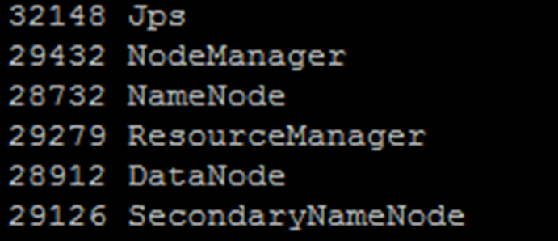

# INSTALL APACHE HADOOP 2.7.0 IN UBUNTU (SINGLE NODE SETUP)
Cheng Juan  
Wednesday, April 29, 2015  

### Ubuntu in Amazon EC2

================================================


source: [Server Refused our key](http://stackoverflow.com/questions/11614254/server-refused-our-key-after-launching-instance-from-private-ebs-ami). Modify a little bit :)
```
- In the AWS Console ensure your instance is healthy and running
- Check you have used the correct public DNS address, listed when you click on an instance
- Select Security Groups from left hand side and click on the security group you want to use
- Click the Inbound tab
- From the Create a new rule: dialog select SSH
- In source put your IP address and CIDR value. If its just you don't have a NAT on your  network just use 32 as your CIDR (eg. ?.?.?.?/32)
- Click Add Rule
- Click the Outbound tab
- choose all traffic and anywhere
- Click Apply Rule Changes
- Right click on your instance and select Create Image (EBS AMI)
- Give it an Image Name in the Create Image wizard and click Create
- After a short time select AMI's from the left hand nav bar in AWS console
- Right click on the new AMI and click Launch Instance
- On the Request Instances Wizard click Continue until you have to Create Key Pair
- Choose a key pair and make note of it (NOTE: If you haven't still got your .pem file for this key pair you will need to generate a new one from selecting Key Pairs on left hand navbar, Create Key Pair etc. to obtain .pem file)

- Select security group with the rule you created for your IP address (and CIDR of 32 - no subnet mask)
- Click continue, and on the next screen click Launch
- Go back to the Instances view and wait until your Instance is fully initialized and healthy
- Open PuttyGEN
- Click Conversions from the Toolbar, and Import Key
- Navigate to your .pem key in the file browser and open it
- Select SSH-1 (RSA) from the Parameters box
- Put your key pair name in the Key comment box (just for good house keeping)
- Click Save private key and save the .ppk file somewhere on your file system
- Open Putty
- Enter the public DNS for your EC2 instance in the Host Name box
- Enter port 22
- Tick SSH radio button from the Connection Type box
- Click on SSH from the Connection tree in the left hand side nav bar
- Click on Auth
- Click Browse in the Authentication parameters box, and open your .ppk file
- Click Session from the left hand nav bar
- Enter a name for this connection in the Saved Sessions text box, and click Save (this is so 
- you don't have to go through the putty connection set up each time, and can just double click your saved connection - for those unaware)
- Click Open
- When prompted for a login name you will probably use 'ec2-user' or 'ubuntu' (TIP: use 'root' - and you will probably get a message telling you what username you should use instead!)
- No need for a password, the .ppk file will authenticate you

```


### install HADOOP 2.7.0 (singale Node setup)

==================================================

Now, install HADOOP 2.7.0. The basic steps follow the source: [Setup newest Hadoop 2.x (2.2.0) on Ubuntu from Codes Fusion](http://codesfusion.blogspot.sg/2013/10/setup-hadoop-2x-220-on-ubuntu.html), but several small modifications. 

#### 1. Prerequistive

**Installing Oracle Java 7**

Apache Hadoop is java framework, we need java installed on our machine to get it run over operating system. Hadoop supports all java version greater than 5 (i.e. Java 1.5). So, Here you can also try Java 6, 7 instead of Java 8.

``` linux
    $ sudo apt-get install openjdk-7-jdk
```
To verify your java installation and link to jdk.

``` linux
    $ java -version
    java version "1.7.0_79"
    OpenJDK Runtime Environment (IcedTea 2.5.5) (7u79-2.5.5-0ubuntu0.14.04.2)
    OpenJDK 64-Bit Server VM (build 24.79-b02, mixed mode)
    
    $ cd /usr/lib/jvm
    $ ln -s java-7-openjdk-amd64 jdk
```

**Add Hadoop Group and User**

To avoid security issues, it's a good practice to setup new Hadoop user group and user account to deal with all Hadoop related activities. We will create hadoop as system group and hduser as system user. 

``` linux

    $ sudo addgroup hadoop
    $ sudo adduser --ingroup hadoop hduser
    $ sudo adduser hduser sudo

```


**Installing SSH**

SSH ("Secure SHell") is a protocol for securely accessing one machine from another. Hadoop uses SSH for accessing another slaves nodes to start and manage all HDFS and MapReduce daemons.

``` linux

    $sudo apt-get install openssh-server

```

#### 2. Installation of Hadoop 2.7.0

**Download latest Apache Hadoop source and install** 

``` linux 
    $wget http://www.motorlogy.com/apache/hadoop/common/current/hadoop-2.7.0.tar.gz
    $tar xfz hadoop-2.7.0.tar.gz
    $mv hadoop-2.7.0 /usr/local/hadoop 

```
`Note`: The name of the extracted folder depends on the Hadoop version your have downloaded and extracted. If your version differs from the one used in this tutorial, change the above command accordingly.`

**Configure Hadoop** 

To complete the setup of Hadoop, the following files will have to be modified:
```
    * ~/.bashrc
    * /usr/local/hadoop/etc/hadoop/hadoop-env.sh
    * /usr/local/hadoop/etc/hadoop/core-site.xml
    * /usr/local/hadoop/etc/hadoop/yarn-site.xml
    * /usr/local/hadoop/etc/hadoop/mapred-site.xml
    * /usr/local/hadoop/etc/hadoop/hdfs-site.xml
```         


* ~/.bashrc

open the `~/.bashrc` and paste the following at the end.Putting the above content in the .bashrc file ensures that these variables are always available when your VPS starts up.

``` linux

   #Hadoop variables
    export JAVA_HOME=/usr/lib/jvm/jdk/
    export HADOOP_INSTALL=/usr/local/hadoop
    export PATH=$PATH:$HADOOP_INSTALL/bin
    export PATH=$PATH:$HADOOP_INSTALL/sbin
    export HADOOP_MAPRED_HOME=$HADOOP_INSTALL
    export HADOOP_COMMON_HOME=$HADOOP_INSTALL
    export HADOOP_HDFS_HOME=$HADOOP_INSTALL
    export YARN_HOME=$HADOOP_INSTALL
    ###end of paste

```
`Note:` if you are using windows, the content you copy from windows may cause problems. So run  
``` linux
dos2Unix file

```


=> /usr/local/hadoop/etc/hadoop/hadoop-env.sh     

Change `JAVA_HOME` variable into 

``` linux
    export JAVA_HOME=/usr/lib/jvm/jdk/

```


=> /usr/local/hadoop/etc/hadoop/core-site.xml        
The /usr/local/hadoop/etc/hadoop/core-site.xml file contains configuration properties that Hadoop uses when starting up. This file can be used to override the default settings that Hadoop starts with. Enter the following content in between the 
tag `<configuration></configuration>` 


``` linux
      <property>
           <name>fs.default.name</name>
           <value>hdfs://localhost:9000</value>
      </property>
 
```

=> /usr/local/hadoop/etc/hadoop/yarn-site.xml 

The /usr/local/hadoop/etc/hadoop/yarn-site.xml file contains configuration properties that MapReduce uses when starting up. This file can be used to override the default settings that MapReduce starts with. Enter the following content in between the 
tag `<configuration></configuration>` 

``` linux       
    <property>
       <name>yarn.nodemanager.aux-services</name>
       <value>mapreduce_shuffle</value>
    </property>
    <property>
       <name>yarn.nodemanager.aux-services.mapreduce.shuffle.class</name>
       <value>org.apache.hadoop.mapred.ShuffleHandler</value>
    </property>
 
```


=> /usr/local/hadoop/etc/hadoop/mapred-site.xml  

By default, the /usr/local/hadoop/etc/hadoop/ folder contains the /usr/local/hadoop/etc/hadoop/mapred-site.xml.template file which has to be renamed/copied with the name mapred-site.xml. This file is used to specify which framework is being used for MapReduce. 

``` linux

cp /usr/local/hadoop/etc/hadoop/mapred-site.xml.template /usr/local/hadoop/etc/hadoop/mapred-site.xml


```
Then open /usr/local/hadoop/etc/hadoop/mapred-site.xml and enter the following content in between the tag `<configuration></configuration>` 

``` linux

    <property>
       <name>mapreduce.framework.name</name>
       <value>yarn</value>
    </property>


```

=> /usr/local/hadoop/etc/hadoop/hdfs-site.xml         

The /usr/local/hadoop/etc/hadoop/hdfs-site.xml has to be configured for each host in the cluster that is being used. It is used to specify the directories which will be used as the namenode and the datanode on that host.

Before editing this file, we need to create two directories which will contain the namenode and the datanode for this Hadoop installation.

``` linux

mkdir -p /usr/local/hadoop_store/hdfs/namenode
mkdir -p /usr/local/hadoop_store/hdfs/datanode

```

Now open /usr/local/hadoop/etc/hadoop/hdfs-site.xml and enter the following content in between the tag `<configuration></configuration>` 

``` linux

    <property>
       <name>dfs.replication</name>
       <value>1</value>
     </property>
     <property>
       <name>dfs.namenode.name.dir</name>
       <value>file:/usr/local/hadoop_store/hdfs/namenode</value>
     </property>
     <property>
       <name>dfs.datanode.data.dir</name>
       <value>file:/usr/local/hadoop_store/hdfs/datanode</value>
     </property>

```
Now Make sure that dir has right owner and permission  /usr/local/hadoop_store. [source](http://stackoverflow.com/questions/26885330/hadoops-datanode-is-not-starting) 

``` linux

    rm -rf /usr/local/hadoop_store
    sudo chown hduser:hadoop -R /usr/local/hadoop_store
    sudo chmod 777 -R /usr/local/hadoop_store


```


**Format Namenode** 

``` linux 

    cd /usr/local/hadoop/
    hdfs namenode -format   

```
**Start all Hadoop daemons** 

``` linux 

    su hduser
    cd /usr/local/hadoop/
    sbin/start-all.sh
    

``

**Check your hadoop**
``` linux
jps

```

if every thing goes well, you will see


         


